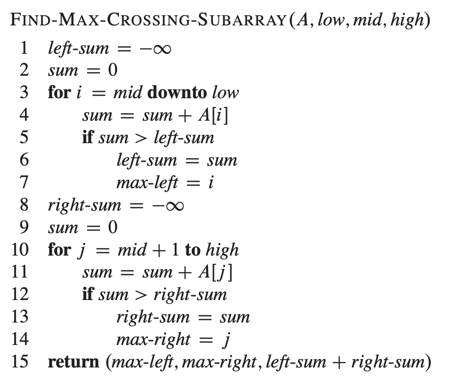

# Divide and Conqer

## Applications

### Mergesort

```python
Mergesort(A, l, r):
  if l < r:
    m = (l + r) // 2
    Mergesort(A, l, m)
    Mergesort(A, m+1, r)
    Merge(A, l, m, r)
```

### Quicksort

```python
Quicksort(A, l, r):
    if l < r:
        p = Partition(A, l, r)
        QUicksort(A, l, p-1)
        Quicksort(A, p+1, r)
```

```python
Partition(A, l, r):
  p = l - 1
  for i = l to r - 1:
    if A[i] < A[r]:
      p += 1
      A[i], A[p] = A[p], A[i]
  A[p + 1], A[r] = A[r], A[p + 1]
  return p + 1
```

### 最大连续子数组

数组A[low, high]的最大连续子数组必定属于以下三种情况之一

- 只位于A[low, mid]
- 只位于A[mid+1, high]
- 同时位于两个子数组一部分

对于前两种情况，都可以通过递归解决。对于第三种情况，由于目标必须跨越mid，所以可以从mid向两侧遍历，分别记录两侧最大和出现的下标，将两侧的下标合起来即为目标数组



