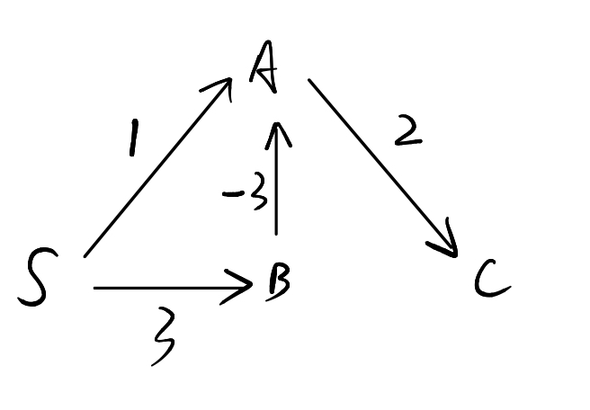

# Graph

## Search

### BFS

```python
BFS(G, s):
  for each v in V:
    v.p = N
    v.d = inf
    v.visited = False
  s.p = N
  s.d = 0
  s.visited = True
  q = queue()
  q.enqueue(s)
  while q is not None:
    v = q.dequeue()
    for u in ADJ[v]:
      if u.visited is False:
        u.visited = True
        u.p = v
        u.d = v.d + 1
        q.enqueue(u)
```

### Simplified BFS

```python
BFS(G, s):
    q = queue()
    visited = set(s)
    q.enqueue(s)
    while q is not empty:
        v = q.dequeue()
        for u in v.neighbors:
            if u not in visited:
                visited.add(u)
                q.enqueue(u)
```


### DFS

```python
DFS(G):
  for each v in V:
    v.p = N
    v.visited = False
  for each v in V:
    if v.visited is False:
      DFS_helper(G, v)
```

```python
DFS_helper(G, v):
  v.visited = True
  for u in G.ADJ[v]:
    if u.visited is False:
      u.p = v
      DFS_helper(G, u)
```

## Shortest Path

### Dijkstra

Directed, non-negative weighted

$O((V+E)\lg V)$

```python
Dijkstra(G, s):
  for each v in V:
    v.p = None
    v.d = inf
  s.d = 0
  Q = PriorityQueue()  // keyed by v.d
  Q = s
  while Q is not empty:
    u = Extract-min(Q)
    for each v in G.ADJ[u]:
      Relax(u, v, G)
      Insert-min(Q, v)
```

```python
Relax(u, v, G):
  if v.d > u.d + G.w(u, v):
    v.d = u.d + G.w(u, v)
    v.p = u
```

Circumstances where Dijkstra fails:

When there is a negative edge (u, v), only the distance of v could be updated to a smaller one when u is extracted out of the queue, assuming v is extracted prior to u. However, any vertex extracted prior to u and reachable from v, could not be updated to have a smaller distance, since there is no way to update them since they are extracted **after v** and they are **not directly connected** with the negative edge. 

For example,



C.d will never be updated as 3-3+2=2, but will be 1+2=3, since updating A.d when visiting B's neighbours has no impact on C.d, which is already set to 3.

### Bellman-Ford

Directed, no restriction on weight

```python
Bellman-Ford(G, s):
  for each v in V:
    v.p = None
    v.d = inf
  s.d = 0
  for i = 1 to |V|-1:
    for each edge (u, v) in E:
      Relax(u, v, G)
  for each edge (u, v) in E:
    if d[v] > d[u] + G.w(u, v):
      return False
  return True
```

### Topology

Directed, acyclic

$O(V+E)$

Topology based on DFS - use a stack

## MST

### Prim

$O(E\lg V)$

```python
Prim(G, r):
  for each v in V:
    v.p = None
    v.key = inf
    v.visited = False
  r.key = 0
  Q = PriorityQueue()  // keyed by v.key
  Q = V
  while Q is not empty:
    u = Extract-min(Q)
    u.visited = True
    for v in G.ADJ[u]:
      if v.visited is False and G.w(u, v) < v.key:
        v.p = u
        v.key = w(u, v)
```

### Kruskal

$O(E\lg E+E\lg V)=O(E\lg V)$, observing that $|E|<|V|^2$

```python
Kruskal(G, w):
  X = emptyset
  for each v in V:
    v.p = v
    v.rank = 0
  Sort(E)  // Sort egdes by weight increasingly
  for each edge (u, v) in E:
    if Find(u) != Find(v):
      X.add((u, v))
      Union(u, v)
  return X
```

```python
Find(x):
  while x != x.p:
    x = x.p
  return x
```

```python
Union(x, y):
  x = Find(x)
  y = Find(y)
  if x.rank > y.rank:
    y.p = x
  else:
    x.p = y
    if x.rank = y.rank:
      y.rank += 1
```

## Topological Sort

A reverse order of the postorder traversal. 

## Network Flow

### Build Residual network

```python
BuildResidualNetwork(G):
  f = FordFulkerson(G)
  for u in V:
    for v in V:
      cf(u, v) = c(u, v) - f(u, v)
      cf(v, u) = f(u, v)
      if cf(u, v) > 0:
        Er.add((u, v))
      if cf(v, u) > 0:
        Er.add((v, u))
```

### Ford-Fulkerson

$O(E|f|)$, where $f$ is the maximum flow

### Edmonds-Karp

$O(VE^2)$

