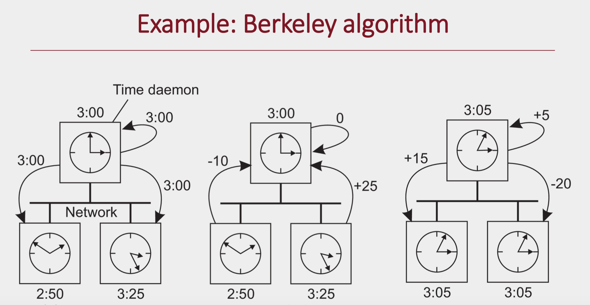
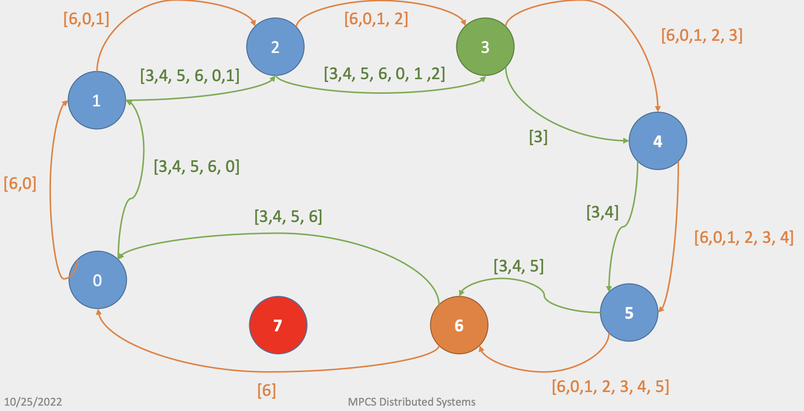
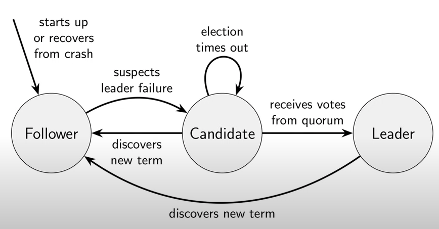
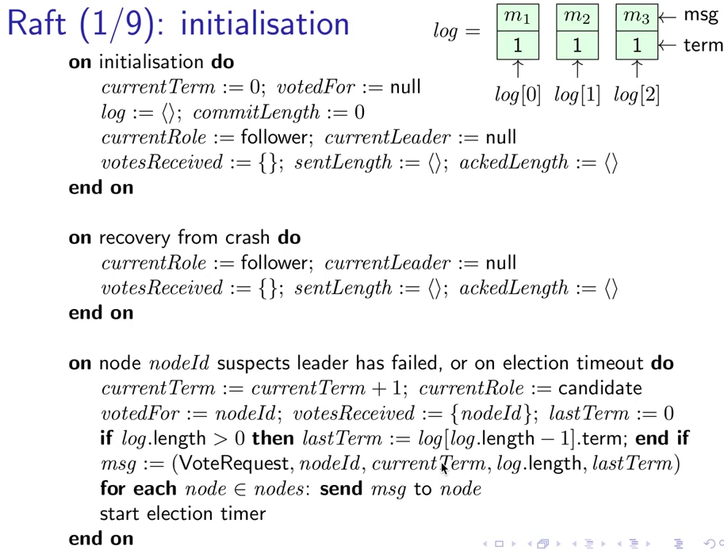
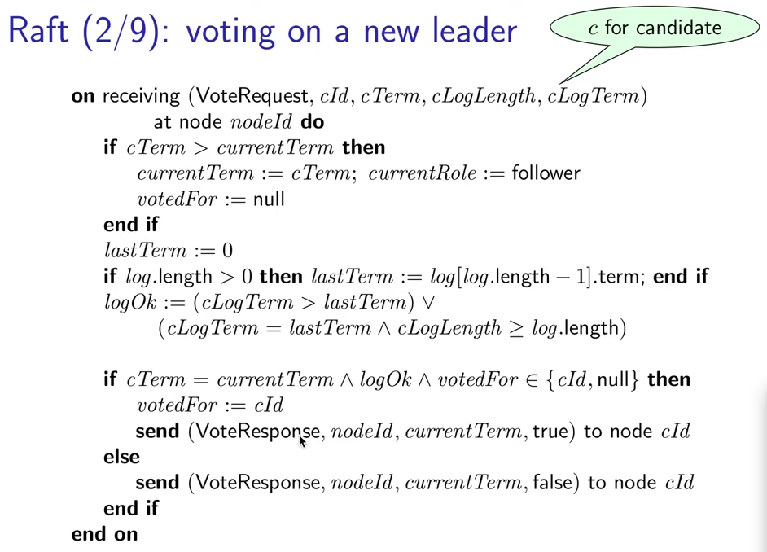
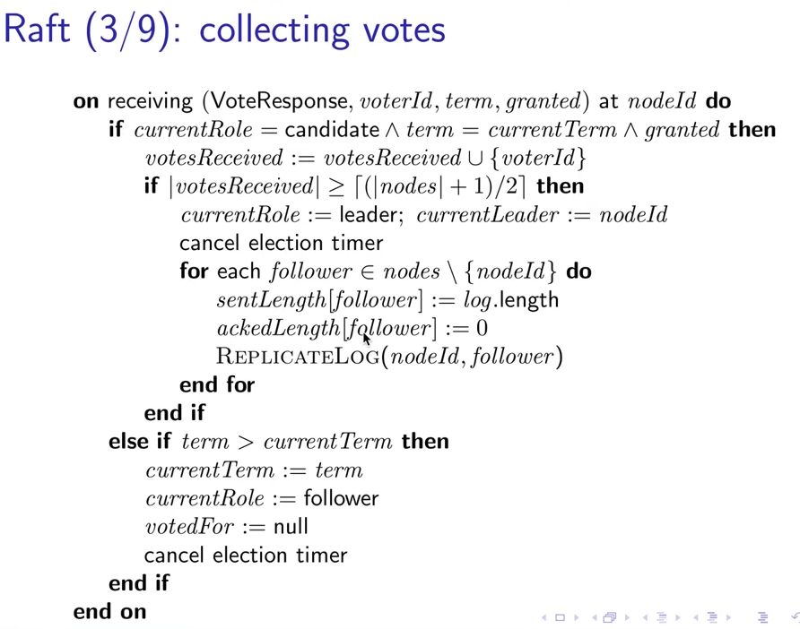
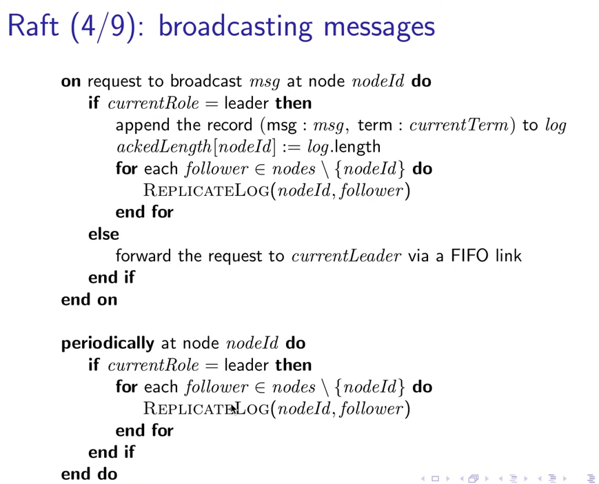
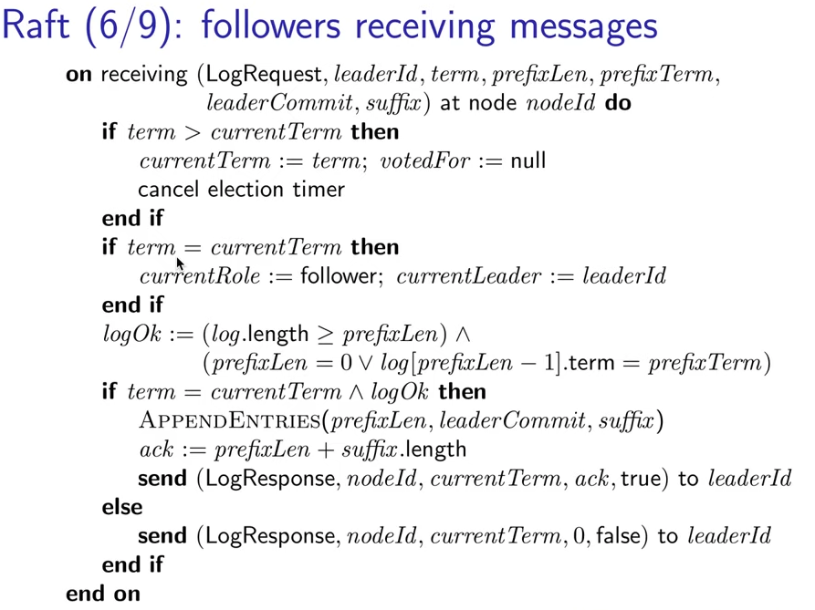
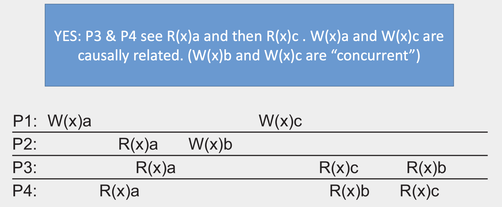

# Distribued System - Video Notes

## Overview

#### Characteristics

- More than one computing element
- Each node is independent from the others
- Each node has its own notion of time and there is no global clock
- Independent failures
- Looks like a single coherent system

#### Type of distributed systems

There are many types of distributed systems including:

- Designed for computation: e.g., HPC clusters
- Designed for information sharing: e.g., distributed databases
- Designed for pervasiveness: e.g., mobile computing and sensor networks

#### Failure

Difficulty in failure detection and recovering

- You cannot distinguish a slow computer from a failing one
- You can never be sure that a server performed an operation before a crash

#### Decentralized

Reasons to avoid using a centralized architecture with a single server

- The computational capacity, limited by CPUs
- The storage capacity, including the I/O transfer rate
- The network between the user and the centralized service
- If the single centralized server fails, it will cause the entire system to fail, the service will be offline.

#### Design goals for building a distributed system

A distributed system should:

1. Make resources accessible (sharing)
2. Hide that resources are distributed (transparency)
3. Be open such that components can be easily used by others (openness)
4. Scale to increasing number of users, resources, locations, ... (scalable)
   1. The computational capacity, limited by CPUs
   2. The storage capacity, including the I/O transfer rate
   3.  The network between the user and the centralized service

#### Fallacies of distributed computing

1. The network is reliable
2. The network is secure
3. The network is homogeneous
4. The topology does not change
5. Latency is zero
6. Bandwidth is infinite
7. Transport cost is zero
8. There is one administrator

## Distribued Architectures

### Introduction

Distributed systems are complicated

- Nodes are distributed and independent
- Nodes may fail and difficult to know that they are failed
- No global clock so coordination is difficult

Software architecture: define how software components are organized and how they should interact

In practice, distributed systems combine many architectures

### Layered Architectures

Components are organized into layers and higher layers make calls to lower layers. Responses are returned from lower to higher levels

- Most applications you use are implemented in layers
  - Python program -> Python libraries -> OS calls
  - Android app -> Android services -> OS calls

- Network communication architectures

Many approaches group into common layers:

- Application interface layer: the user interface
- Processing layer: logic and function of the application
- Data layer: state manipulated by application component

### Object-based/service-based architectures

Object-based architectures:

- Components are objects, connected to each other through procedure calls
- Objects may be placed on different nodes; calls can execute across a network

Client -> proxy -> skeleton -> object

The object-based model is similar as a service-based model

- The service is realized as a self-contained entity, that can make use of other services

The distributed application is composed of many different services

Microservices: structure application as a collection of loosely coupled services

### Resource-based architectures

A simple way of designing a system is to think about *resources* and provide a fixed set of interfaces for manipulating those entities

Representational State Transfer (REST)

- A distributed system as a collection of resources, individually managed by components.
- Resources may be added, removed, retrieved, and modified by (remote) applications

- Characteristics:

1. Resources are identified through a single naming scheme
2. All services offer the same interface
3. Messages sent to or from a service are fully self-described
4. After executing an operation at a service, that component forgets everything about the caller

Example: AWS S3

| Operation | Description                                 |
| --------- | ------------------------------------------- |
| PUT       | Create a new resource                       |
| GET       | Retrieve the state of a resource            |
| DELETE    | Delete a resource                           |
| POST      | Modify a resource by transferring new state |

### Event-based systems

Separation between *processing* and *coordination*

Referentially decoupled but temporally coupled

Example: pub-sub architecture

## Process and Virtualization

### Process & Thread

#### Process

Virtual Processor: For each program, OS maintains a process table to store CPU register values, OS maintains a **process table** to store CPU register values, memory maps, open files, etc.

-  These entries are called a *process context*

Summary

- A program in execution (i.e., on an OS virtual processor)

- OS ensures that processes are independent (reliant on H/W support)
- Creating a process == OS must create a new address space

- Heavyweight but strong isolation

#### Thread

Executes its own piece of code (like a process)

Independent of other threads

**Difference with Process**

- There is little focus on concurrency transparency; isolation is left for developers to manage
- Threads share the same address space while processes do not
- Context switching is independent of the OS which means it's cheaper, while process switching involves OS

#### Threads user space

Many-to-one model in which many threads are mapped to one kernel process

#### Threads in kernal space

OS manages thread table

One-to-one model: every thread is a schedulable entity

#### Multithreaded Clients

- Hiding network latencies:
  - E.g., web browser scans HTML page to find elements that need to be fetched
  - Each file is fetched by a separate thread, each doing a (blocking) HTTP request
  - As files come in, the browser displays them

- Multiple request-response calls to other machines (RPC)
  - A client does several calls at the same time, each one by a different thread
  - It then waits until all results have been returned
  - Note: if calls are to different servers, we may have a linear speed-up

#### Multithreaded Servers

- Improve performance
  - Having a single-threaded server prohibits simple scale-up to a multiprocessor system
  - As with clients: hide network latency by reacting to next request while previous one is being replied

- Better structure
  - Most servers have high I/O demands. Using simple, well-understood blocking calls simplifies the overall structure.
  - Multithreaded programs tend to be smaller and easier to understand due to simplified flow of control.

#### Summary

- Processes have a lot of state and context switching can be expensive
- Threads provide a lightweight way of achieving concurrent execution
- Distributed systems rely on threads for several reasons:
  - Asynchronous communication
  - Scaling across processors and cores

### Virtualization

Virtualization can occur at many levels

#### Virtual Machines

Allow users to run multiple operating systems

#### Containers

Originally developed as a way to segregate namespaces in Linux OS for security

#### Summary

- Virtualization enables you to run a *virtual* computer system using an abstraction layer above the hardware
- Virtual machines (supported by hardware) allow for multiple operating systems to be run on a single machine

- Containers provide lightweight virtualization on top of an operating system
  - Enables application portability

### Client-server organization

#### Clients

Thick client

Thin client

#### Client-side distribution transparency

Often clients maintain state and perform processing (primarily as a means of either distributing load or abstracting distribution)

1. Access transparency: client stubs for RPC
2. Location/migration transparency: client tracks actual location
3. Replication transparency: E.g., multiple servers, client stub will handle replicated invocations to each server
4. Failure transparency: client must support if masking server/communication failures

#### Server

General design issues:

1. Concurrent vs iterative
2. How to contact a server
3. Interrupting a server
4. Stateless vs stateful

Stateless server

- Advantages
  - Independence: clients/servers are independent
  - Inconsistency: if client/server crashes there is no need to sync

- Disadvantage
  - Performance: server cannot anticipate client behavior

#### Client-server organization: server clusters

Client requests -> dispatched requests -> application/compute servers -> distributed file/database system

## Communication Techniques

### Computer Networking

Reasons that why we use independent headers rather than combining all protocal headers into a single header

- Not every communication uses every layer of the stack
- Separate headers means that each layer can be written without any knowledge of the layers below.
- Intermediate devices (routers/bridges) can be implemented for the lower layers where those device don’t know & don’t care about the traffic being carried over them.

### Message Passing

#### RPC

Procedure call interface that abstracts distribution

#### Sockets

Problem

- Very low level
- OS-specific
- Byte stream, not messages
- Little support for common communication patterns

#### ZeroMQ

Request-reply pattern

Publish-subcribe pattern

#### MPI

- Point-to-point

- Broadcast

- Scatter/Gather

#### Message Oriented Middleware

IBM MQ, Rabbit MQ, Active MQ, Qpid

Difference from Socket-based massaging

- Asynchronous communication

- Sender/receiver need not be online at the same time
- Message delivery is therefore targeted at larger latency 

Queues are managed by queue managers

Application can only put in local queue and get froma local queue

Message broker

AMQP Model

- Application creates a connection to a queue manager
- Bidirectional communication estabilished through sessoins
- Messages are transferred over a link

AMQP Communication

### Multicast Communication

#### Performance & Metrics

- Link stress: how often a packet cross the same link
- Relative Delay Penalty
- Tree cost

#### Gossip-based (epidemic) dissemination

Two forms of epidemics

- Anti-entropy
- Rumor spreading

Removing data: a specical update by inserting a death certificate

#### Advantages over relying on a source node to share a message with all other nodes

1. Distribute the workload more evenly and balance the link stress, also avoiding the cpu resource wasted or os interruption
2. Multicasting does not affect all computers on the network. Therefore, multicasting prevents unwanted message transmission and avoids clogging of the network. 
3. Multicast messages can be forwarded through routers that are multicast-enabled. However, a broadcast message can be sent to all the computers on the local network and not across an internetwork.

## Naming

### Introduction

Names refer to entities, provide location-independent references

Address is the name of an access point for an entity

Identifiers are names where one identifier refers to only one entity and is never reassigned

1. An identifier refers to at most one entity
2. Each entity is referred to by at most one identifier
3. An identifier always refers to the same entity (i.e., it is never reused)

Human-friendly names are represented as character strings

### Flat Naming

No information is encoded in the name that can help us locate the entity to which it refers

#### Simple solutions

#### Home based approaches

#### Distributed Hash Table

Each data item hasded to an m-bit key

Data item with key k is managed by node with the smallest identifier id >= k

- referred to as successor of k

Each node maintains a finger table (shortcuts) of size *s*

- s <= m entries

- $FT_p[i]=succ(p+2^{i-1})$

Joining and updating finger tables

1. Find the next node, set the predecessor of the next node to this new node
2. Each node reach to its successor to see whether the node is its predecessor.
   1. if not, then recompute finger table

Leaving the network

1. Each node regularly check if its predecessor is alive
   1. if not alive, set pred to "unknown"
   2. update the predecessor of the successor of a valid node when updating

#### Hierarchical approaches

### Structed Naming

#### Namespaces

#### Name resolution

Iterative

- Resolver hands over complete name to the root name server (using well-known address)
- Root server will resolve path as far as it can and return to the client
- Client will then contact the next name server

Recursive

- Client requests resolution from the root name server
- Root name server then passes the request to the next name server
- Name servers will return the result following the same approach

- Advantage: local caching is more effective than communication; costs reduced

- Disadvantage: additional load on name servers

#### Closure mechanism

### Attributed-based naming

## Coordination & Synchronization

### Clock Synchronnization

The difference in time between clocks is called clock skew

Goals:

- Internal synchronization: keep deviation between two clocks on any two machines within a specified bound (precision)
- External synchronization: keep bound to an external reference source such as UTC (accuracy)

#### Christian’s algorithm

- A requests the time from B

- After receiving the request B prepares a response and appends the time T from its own clock
- A then sets its time to be T + RTT/2

Better to slow down until correction has been made

#### NTP

Solution: organize into a hierarchy where the number represents distance from the reference clock

#### Bakery

Decentralized

#### Reference broadcast synchronization

For wireless network

Assumption:

- No single node has an accurate time

Aims:

- Only satisfy internal synchronization (doesn’t try to sync with external time)
- One way protocol – only receivers synchronize
- Deal with the fact that there can be large delays in wireless networks when sending (e.g., due to contention protocol) so we have little idea how long until a message is transmitted

### Logical Clocks

#### Happens Before relationship

The happens before relationship: *a → b* 

- If *a* and *b* are two events **in the same process**, and *a* comes before *b*, then *a → b*
- If *a* is the sending of a message, and *b* is the receipt of that message, then *a → b*

#### Lamport’s Logical clocks

Each process Pi maintains a local counter Ci and adjusts this counter

1. Each new event that takes place within Pi, Ci is incremented by 1
2. Each time a message m is sent by process Pi, the message receives a timestamp ts(m) = Ci
3. Whenever a message m is received by a process Pj, Pj adjusts its local counter Cj to max{Cj, ts(m)}; then executes step 1 before passing m to the application

#### Vector Clocks

### Mutual Exlusion

#### General approaches

- Permission-based approach: Process wanting to access a resource first acquires permission from other

  processes

- Token-based approach: Only one token available and whoever has it can access the shared resource

#### Centralized coordinator

- Pros:
  - Easy to demonstrate that it guarantees mutual exclusion
  - Fair (requests are granted in the order they arrive)
  - No starvation (no process waits for ever)
  - Easy to implement
  - Relatively efficient (requires only 3 messages per resource)

- Cons:

  - Single point of failure

  - Cant distinguish a dead coordinator from permission denied (as no message is returned)

#### Distributed algorithm

- Pros

  - Mutual exclusion guaranteed
  - No starvation or deadlock

- Cons

  - Messaging overhead: (N-1) to request access, (N-1) OKs

  - N points of failure (requires a response from each other process)
  - Overcome by altering the algorithm: when request arrives receiver always replies (either grant/deny). Add a timeout to detect if request is lost and retry (or conclude it is dead)

  - Requires multicast communication (and each process must know of all other processes)

#### Token ring algorithm

- Pros

  - Guarantees mutual exclusion

  - Starvation cannot occur

  - Detecting failures is not too bad, when passing off the token a process can determine if their neighbor has failed

- Cons

  - When a process wants to access the resource it might have to wait for every other process

  - If the token is lost (e.g., because holding process fails) it must be regenerated
  - Even detecting that the token is lost might be hard as there is no known time for the token to circulate

#### Decentralized mutual exclusion

#### Comparison

- Centralized: simple but not fault tolerant
- Distributed: fault tolerant but not efficient
- Token ring: simple but can be slow to access
- Decentralized: flexible but complicated to implement

### Election Algorithms

#### Bully algorithm

Send election messages to all processes with higher identifiers, if no one replies, node wins election and becomes coordinator

#### Ring algorithm

Send election messages in a ring, after message goes around the entire ring, the one with the highest ID becomes coordinator

## Fault Tolerance

### Failures & Resilience

#### Dependable systems

- Availability
- Reliability
- Safety
- Maintainability

#### Fault

The cause of an error is a fault

Fault tolerance means that a system can provide services in the presence of faults

- Crash failure: Halts
- Omission failure: Fails to respond to incoming requests
- Timing failure: Response lies outside a specified time interval
- Response failure: Response is incorrect
- Byzantine/Arbitrary failure: May produce arbitrary responses at arbitrary times

#### Resilience by process groups

Key approach is to organize several identical processes into a group • When a message is sent to the group, all members receive it. If one fails, another can take over

- Flat group
- Hierarchical group

We replicate processes and organize into a group

- A system is said to be k-fault tolerant if it can survive faults in k components
- With silent failures then having k+1 processes is sufficient
- With byzantine failures we need at least 2k+1 non-faulty processes

### Distributed Consensus

#### Consensus

The process by which *nodes* in a distributed system reach agreement on something (value, lock, operation, etc.)

Consensus cannot be guaranteed in an asynchronous distributed system within bounded time if a node *might* fail

- We cannot reliably detect failure (between a crashed node and a slow node)

No asynchronous consensus algorithm can guarantee both safety and liveness

- Safety: something bad will never happen
- Liveness: something good will happen

#### Simple approaches: 2-phase

- Phase 1: commit-request (or voting)

  - Coordinator suggests value to all nodes and gathers

    responses (yes/no)

  - Participants execute transaction up to commit

- Phase 2: commit

  - If everyone agrees, coordinator tells nodes the value is

    final, they commit, then ACK

  - If anyone disagrees, tell all nodes to rollback, then ACK

If coordinator crashes, other nodes are in uncertain states until the coordinator comes back

#### Simple approaches: 3-phase

- Phase 1: voting

  - Coordinator suggests value to all nodes and gathers responses (yes/no)

- Phase 2: prepare commit

  - If all reply yes then coordinator sends “prepare commit”

  - Each node executes up to commit and ACKs receipt of message

- Phase 3: commit

  - If coordinator receives ACK from all nodes it tells all nodes to commit

  - If any node says no it aborts

2PC and 3PC work under some situations, but are not resilient to network partitions and byzantine failures

### Paxos

Both Paxos and Raft assume a partially synchronous, crash-recovery system model

- FLP result: There is no deterministic consensus algorithm that is guaranteed to terminate in an asynchronous crash-stop system model.

#### Roles

- Client
- Acceptor
- Proposer
- Leader
- Learner

#### Basic Protocol

1a: Prepare

- A **proposer** selects a proposal number *n* and sends a *prepare* request with number *n* to a majority of **acceptors** (n > any number used by proposer)

1b: Promise

- If an **acceptor** receives a *prepare* request with number *n* greater than that of any *prepare* request to which it has already responded, then it responds to the request with a promise not to accept any more proposals numbered less than *n* and with the highest-numbered proposal (if any) that it has accepted
- Otherwise, the **acceptor** can ignore the proposal.

2a: Accept

- If the proposer receives a response to its *prepare* requests (numbered *n*) from a majority of acceptors, then it sends an *accept* request to each of those acceptors for a proposal numbered *n* with a value *v*, where *v* is the value of the highest-numbered proposal among the responses, or is any value if the responses reported no proposals.

2b: Accepted

- If an acceptor receives an *accept* request for a proposal numbered *n*, it accepts the proposal unless it has already responded to a *prepare* request having a number greater than *n*. It should send an accept message to the proposer and every learner.

#### Two things over 2PC

- The first is ordering the proposals so that it may be determined which of two proposals should be accepted

- The second is to consider a proposal accepted when a majority of acceptors have indicated that they have decided upon that proposal

### Raft

#### 3 core problems

1. Leader election:
   - Select one server to act as leader
   - All message passing initialized by leader (or node attempting to become leader)
   - Detect crashes, choose new leader

2. Log replication (normal operation)

   - Leader accepts commands from clients, appends to its log
     - Note: clients must communicate with leader

   - Leader replicates its log to other servers (overwrites inconsistencies)

3. Safety
   - Keep logs consistent
   - A few tricks e.g., only servers with up-to-date logs can become leader

#### Terms

- Every Raft communication includes (and compares) current term
- Terms are updated when a node starts an election or when the current term communicated from another server is higher than its own
- Communication with a node with a higher term is rejected

#### Leader Election

Leader sends heartbeats, if a node does not get a heartbeat (or another message) from the leader within a timeout period it initiates an election

1. Follower increments current term and transitions to candidate state 
2. Votes for itself 
3. Issues *RequestVote* to each other node
4. Waits until:

- Wins the election (majority of nodes vote)
- Another server establishes itself as leader
- A period of time passes without a winner (restarts election)

Other nodes will vote for at most one candidate in a term using FCFS

#### Log replication

- Leader accepts commands from clients
- Appends command to its own log
- Issue *AppendEntries* RPC to each other node
- When command is applied to all other nodes, leader then commits it to their state machine (includes all prior entries)
- If followers crash or run slowly the leader retries indefinitely until all followers store all log entries

#### Leader Failure

- The leader handles inconsistencies by forcing the followers’ logs to duplicate its own (strong leader model)
- Find the latest log where the two logs agree, delete entries in the follower’s log after that point, and send follower the leader’s entries

- Safety guaranteed by several restrictions
  - Election restriction: voting process to prevent candidate from winning unless its log contains all committed entries
  - Committing from previous term: if leader crashes before commit, future leaders will attempt to complete the commit

## Cambridge Lectures on Consensus and Raft

### Consensus

Automatically choose a new leader when the leader fails

Paxos, Raft, ... assume a partially synchronous crash-recovery system model

- There is no deterministic consensus algorithm that is guaranteed to terminate and make progress to broadcast values in an aynschronous crash-stop system.
- Paxos, Raft, ... use clocks only used for timeouts/failure detector to ensure program. Safety does not depend on timing, while liveness does depend on.

#### Leader Election

Use a failure detector (timeout) to determine suspected crash or unavailability of leader

On suspected leader crash, elect a new one

Prevent two leaders at the same time

Ensure <= 1 leader per **term**

- Term is increamented every time a leader election is started
- A node can only **vote once** per term
- Require a **quorum** of nodes to elect a leader in a term

### Raft

Core: state machine

Here we assume that the leader has already sent log.length nums of logs to other nodes.

Prefix: we think we have already sent to the follower

Suffix: new log entires we think we have not yet sent to the follower

## Consistency

### Data-centric consistency models

#### Basic Idea

To keep replicas consistent, we generally need to ensure that all conflicting operations are done in the same order everywhere

- Read-write conflict
- Wrtie-wrtie conflict

Guaranteeing global ordering on conflicting operations may be a costly operation, downgrading scalability

- Solution: weaken consistency requirements so that hopefully global synchronization can be avoided

#### Consistency model

A contract between processes and the data store

- It says that if processes (or the data store) agree to obey certain rules, the store promises to work correctly.

Normally, a process that performs a read operation on a data item expects the operation to return a value that shows the results of the last write operation on that data

Without a global clock its hard to know which operation was the last... So we often provide more relaxed consistency models restricting what can be returned

#### Continuous consistency

How can we loosen consistency? Consider a degree of consistency

- replicas may differ in their numerical value (e.g., +/0 5%)
- replicas may differ in their relative staleness (e.g., weather report relevant for hours)
- differences with respect to (number and order) of performed update operations (within some bound)

#### Sequential consistency

No mention of time, just that processes see the same order/interleaving of operations

#### Causal consistency

Remember we often we don’t care about sequential ordering.. What we care about is ordering of events that are potentially causally related and those that are not

- If event b is caused by event a, causality requires that everyone first see a and then b

For a data store to be considered causally consistent, it is necessary that the store obeys the following condition:

- *Writes that are potentially causally related must be seen by all processes in the same order.*

- *Concurrent writes may be seen in a different order on different machines.*

#### Eventual consistency

In the absence of write-write conflicts, all replicas will converge toward identical copies of each other

Essentially requires only that updates are guaranteed to propagate to all replicas

### Client Centric Consistency

Provide guarantees that a single client sees consistent data

#### Monotonic reads

*If a process reads the value of a data item x, any successive read operation on x by that process will always return that same or a more recent value*

The read operations performed by a single process P at two different local copies of the same data store

#### Monotonic writes

*A write operation by a process on a data item x is completed before any successive write operation on x by the same process*

That is, if we have two successive operations Wk(xi) and Wk(xj) by process Pk, then, regardless where Wk(xj) takes place, we also have WS(xi;xj)

#### Read your writes

*The effect of a write operation by a process on data item x will always be seen by a successive read operation on x by the same process*

#### Writes follow reads

*A write operation by a process on a data item x following a previous read operation on x by the same process is guaranteed to take place on the same or a more recent value of x that was read*

### Replica Management and Consistency Protocols

#### Choosing replica locations

#### Permanent replicas

#### Server-initiated replicas

Each server keeps track of access counts per file, aggregated by considering server closest to requesting clients

- Number of accesses drops below deletion threshold D➔drop file

- Number of accesses exceeds replica threshold R➔replicate file

- Number of access between D and R the file may only be migrated

#### Client-initiated replicas

Otherwise known as caching

#### State vs operations

Notification of update (i.e., just that the data has changed)

- Common with cache invalidation models
- Uses little network bandwidth, good when many more updates than reads

Transfer data from one copy to another (passive replication)

- Most common approach, good when many more reads than writes
- Must update before the next read happens

Send the update operation to other copies (active replication)

- Each replica managed by process that keeps data up to date
- Minimal bandwidth, but more work on replica

#### Push vs pull

Pushing updates: server-initiated approach, in which update is propagated regardless whether target asked for i

- Efficient when many more reads than writes (i.e., we expect the replica is read)

Pulling updates: client-initiated approach, in which client requests to be updated

- Efficient when many more writes than reads

#### Hybrid approach: leases

#### Primary-based protocols

Remote-write protocols

Local-write protocols

#### Replicated-write protocols

Tradeoffs between read & write performance

## Distribued Data

### RDBMS & NoSQL

#### CAP

**C**onsistency: All entities see the same data at the same time

**A**vailability: Every request receives a non-error response for every operation

**P**artition tolerance: The system continues to operate even when connections between nodes are down/slow

Network partitions are inevitable.. Really a case of C vs A

- C: return an error if we cant guarantee data is up to date
- A: process the operation even though it might be wrong/lead to inconsistency

Databases (C over A)

- Atomic
- Consistent*
- Isolation
- Durability

NoSQL (A over C)

- Basically
- Available
- Soft state
- Eventual consistency

#### ACID

- Atomicity
- Consistency
- Isolation
- Durability

### Distributed File Systems and Shared Memory

