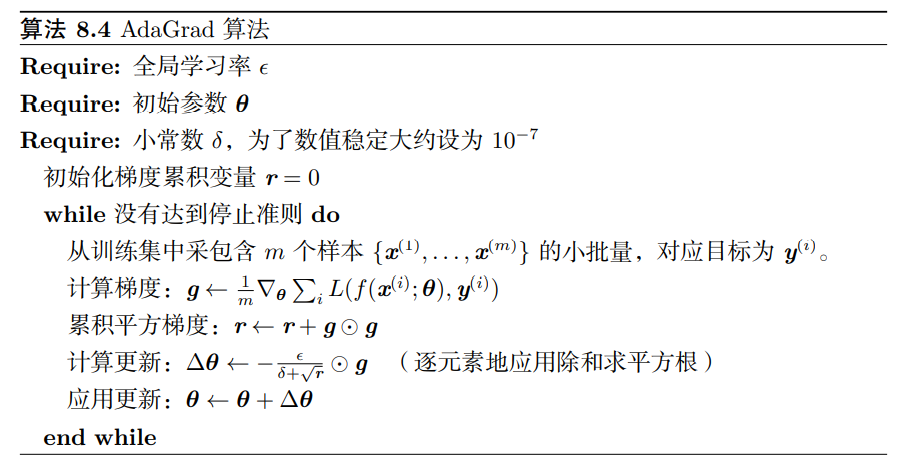
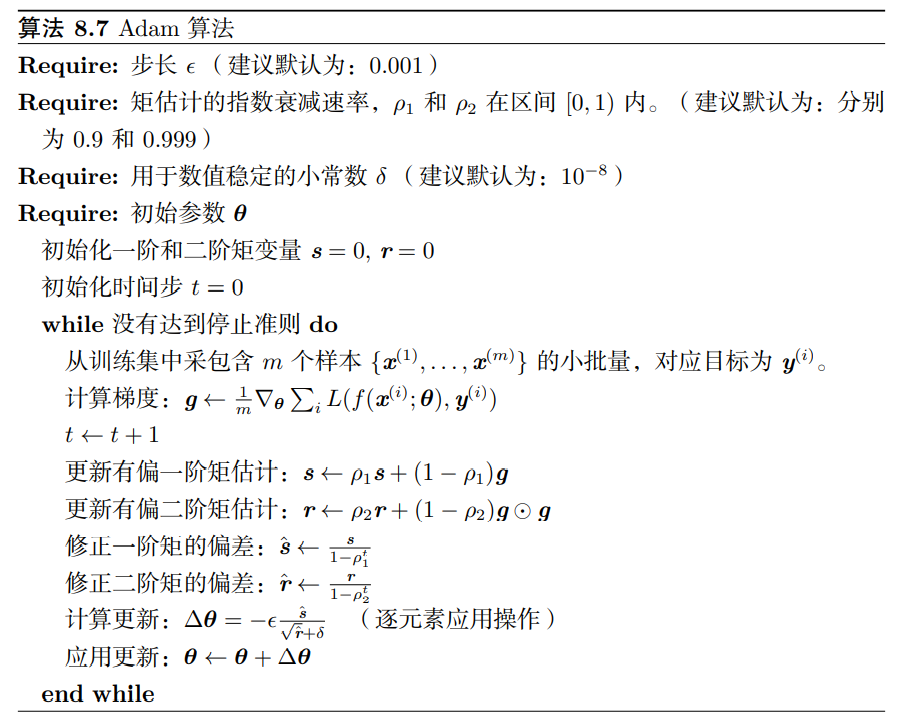
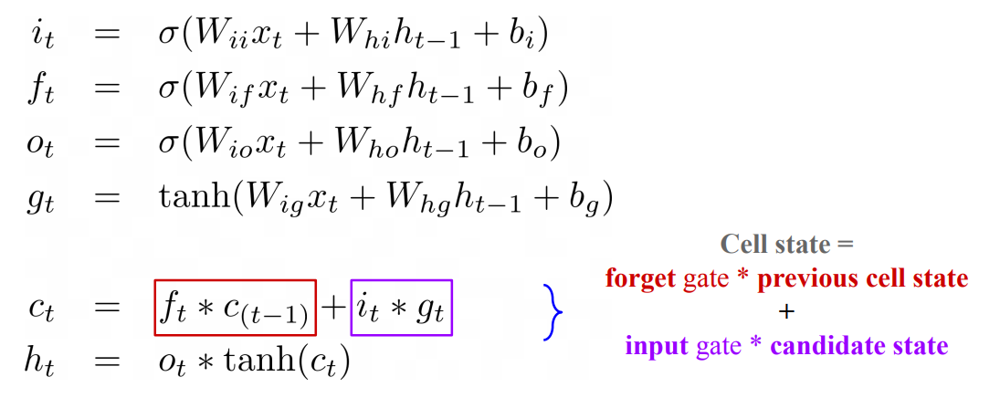
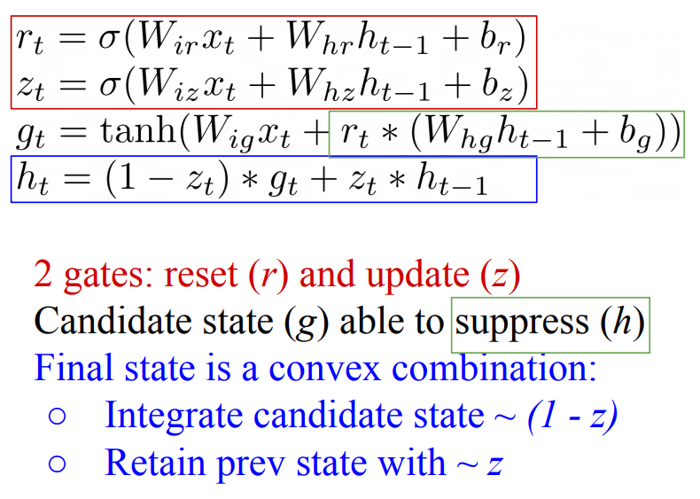

# 深度学习

深度学习花书学习笔记

面经笔记

## Normalization

BN：Batch Norm，每次对batch中的数据按维度进行 Normalization

LN：Layer Norm，每次对单个序列进行 Normalization

- More commonly applied in NLP tasks, since sentence length varies
- Layer Norm does not has batch-wise dependence, which requires additional need for synchronization across devices

## Loss

### 交叉熵

$$
L=\sum^N_{i=1}y_i\log\hat y_i+(1-y_i)\log(1-\hat y_i)
$$

## 优化

### 梯度

#### 梯度消失和梯度爆炸

梯度消失

原因：隐藏层数过多/采用了不合适的激活函数

- 换用Relu激活函数
- BatchNormalization
- 残差结构

梯度爆炸

原因：隐藏层数过多/权重初始化值过大

- 梯度剪切
- 正则化

### 基本优化算法

#### 随机梯度下降（SGD）

花书P251：梯度估计：$\hat g\leftarrow\frac{1}{m}\nabla_\theta\sum_iL(f(x^i;\theta),y^i)$

一般使学习率线性衰减学习率到$\tau$次迭代：$\epsilon_k=(1-\alpha)\epsilon_0+\alpha\epsilon_\tau,\alpha=\frac{k}{\tau}$。$\tau$步迭代之后，学习率一般保持常数

#### AdaGrad

独立地适应所有模型参数的学习率，缩放每个参数反比于其所有梯度历史平方值总和的平方根。然而，从训练开始时积累梯度平方会导致有效学习率过早和过量的减小

#### RMSProp

改变梯度积累为指数加权的移动平均，丢弃遥远过去的历史。使用移动平均引入了一个新的超参数$\rho$

#### Adam

引入一阶矩和二阶矩变量，一阶矩相当于引入了动量。Adam还包括偏差修正（初始一阶矩估计、二阶据估计存在偏差，因为是随机初始化的）

## 正则化

### 参数范数惩罚

$$
\tilde J(\theta;X,y)=J(\theta;X,y)+\alpha \Omega(\theta)
$$

不同的参数范数$\Omega$会偏好不同的解

通常只对权重做惩罚而不对偏置做惩罚，因为偏置只控制一个单变量，不会导致太大的方差

#### $L^2$参数正则化

通常被称为权重衰减（weight decay）：$\Omega(\theta)=\frac{1}{2}||w||^2$，也被称为岭回归

使用梯度下降更新权重：
$$
w\leftarrow w-\epsilon(\alpha w+\nabla_w J(w;X,y))\\
w\leftarrow(1-\epsilon\alpha)w-\epsilon\nabla_wJ(w;X,y)
$$
即在单步更新中，先收缩权重向量

进一步分析，令$w^*=\arg\min_wJ(w)$，并在$w^*$的邻域对目标函数做二次近似：
$$
\hat J(\theta)=J(w^*)+\frac{1}{2}(w-w^*)^TH(w-w^*)
$$
其中H是J在$w^*$处和Hessian矩阵。当$\hat J$取得最小时，其梯度$\nabla_w\hat J(w)=H(w-w^*)$为0.添加权重衰减的梯度，并用$\tilde w$表示此时的最优点：
$$
\alpha\tilde w+H(\tilde w-w^*)=0\\
(H+\alpha I)\tilde w=Hw^*\\
\tilde w=(H+\alpha I)^{-1}Hw^*\\
\tilde w=Q(\Lambda+\alpha I)^{-1}\Lambda Q^Tw^*
$$
权重衰减的效果：根据$\frac{\lambda_i}{\lambda_i+\alpha}$因子缩放与H第i个特征向量对齐的$w^*$的分量。沿着H特征值较大的方向正则化影响较小，而特征值较小的w分量将会收缩到几乎为零。

以机器学习中线性回归为例，不加L2正则化时：
$$
L=(Xw-y)^T(Xw-y)\\
w=(X^TX)^{-1}X^Ty
$$
添加之后：
$$
L=(Xw-y)^T(Xw-y)+\frac{1}{2}\alpha w^Tw\\
w=(X^TX+\alpha I)^{-1}X^Ty
$$
相当于在原来矩阵的中添加了对角$\alpha$。由于$\frac{1}{m}X^TX$是协方差矩阵，对角项对应每个输入特征的方差，因此L2正则化能让学习算法“感知”到具有较高方差的输入x，因此与输出目标的协方差较小（相对增加方差）的特征的权重将会收缩

#### $L^1$参数正则化

$$
\tilde J(w;X,y)=\alpha||w||_1+J(w;X,y),||w||_1=\sum_i|w_i|\\
\nabla_w\tilde J(w;X,y)=\alpha sign(w)+\nabla_w J(w;X,y)
$$

类似地，有梯度$\nabla_w\hat J(w)=H(w-w^*)$。进一步假设Hessian矩阵是对角的，即$H=diag([H_{1,1},...,H_{n,n}])$。将L1正则化目标函数的二次近似分解成参数的求和
$$
\hat J(w;X,y)=J(w^*;X,y)+\sum_i[\frac{1}{2}H_{i,i}(w_i-w_i^*)^2+\alpha|w_i|]
$$
如下解可以最小化这个近似代价函数：
$$
w_i=sign(w^*_i)\max\{|w^*_i|-\frac{\alpha}{H_{i,i}},0\}
$$

- $w^*_i<=\frac{\alpha}{H_{i,i}}$时，正则化后$w_i=0$，因为在方向i上$J$对$\hat J$的贡献被抵消
- $w^*_i>=\frac{\alpha}{H_{i,i}}$时，正则化将$w_i$在i方向移动一段距离

L1正则化会产生更稀疏的解，即一些参数为0，只要有足够大的$\alpha$。这种稀疏性广泛应用于特征选择。

### Dropout

Dropout提供了一种廉价的Bagging集成近似，能够训练和评估指数级数量的神经网络：从基础网络去除非输出单元后形成的子网络。与Bagging不同，所有子模型共享参数。和Bagging相同的是，每个字网络遇到的训练集确实是有放回采样的原始训练集的一个子集。

使用基于小批量产生较小步长的学习算法，比如SGD。每次在小批量中加载一个样本，然后随机抽样应用于网络中所有输入和隐藏单元的不同二值掩码。每个单元的掩码是独立采样的。掩码值为1的采样概率是训练开始前一个固定的超参数 - 输入单元被包括的概率通常为0.8，隐藏单元被包括的概率一般为0.5

通过下式来计算每个模型的投票结果几乎不可能，因为包含多达指数级的项：
$$
\sum_{\mu}p(\mu)p(y|x,\mu)
$$
替代方法：利用集成成员预测分布的几何平均。这要求没有子模型给某一事件分配概率0，并重新标准化所得分布：
$$
\tilde p_{ensemble}(y|x)=\sqrt[2^d]{\Pi_\mu p(y|x,\mu)}\\
p_{ensemble}(y|x)=\frac{\tilde p_{ensemble}(y|x)}{\sum_{y'}\tilde p_{ensemble}(y'|x)}
$$
近似p_ensemble的方法：将单元i的输出权重乘以单元i被包含的概率 - 从该单元得到正确的输出期望值 - 权重比例推断规则。因为通常使用1/2的包含概率，相当于在训练结束后将权重/2（或者在训练过程中把状态*2）。

Dropout比其他标准的计算开销小的正则化方法更有效，也可以与其他的正则化合并。但在训练样本极少时，Dropout不会很有效。

Dropout强大的大部分原因来自施加到隐藏单元的掩码噪声，可以看作是对输入内容的高度智能化、自适应破坏的一种形式，而不是对输入原始值的破坏。破坏提取的特征而不是原始值，让破坏过程充分利用该模型迄今获得的关于输入分布的所有知识。

## RNN

基本形式：$h_{t+1}f(h_t,x_t)=\tanh(Wh_t+Ux_t)$

### LSTM总结

### GRU总结

