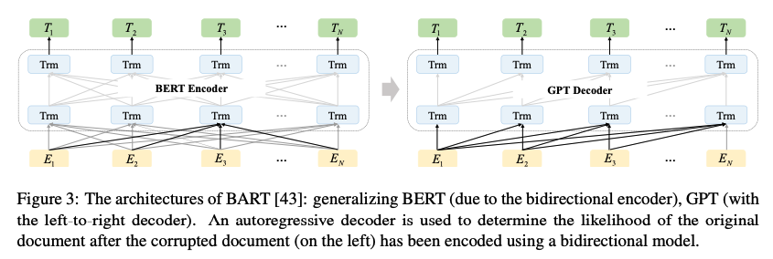
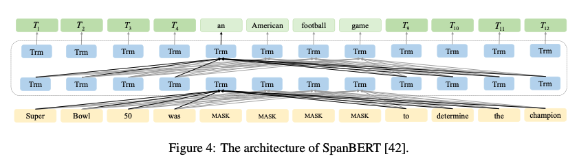

# LLM

## Paper Readings

### A Comprehensive Survey on Pretrained Foundation Models: A History from BERT to ChatGPT

#### Semi-supervised Learning Mechanisms

Given an unlabelled dataset $Z=\{z_i\}^m_{i=1}$, the learning process could be formalized as
$$
\arg\min_\theta \frac{1}{n}\sum^n_{i=1}L(f(x_i;\theta),y_i)+\frac{1}{m}\sum^m_{i=1}L'(f'(z_i;\theta'),R(z_i,X))+\lambda\Omega(\theta)
$$

- $L,\Omega$: loss function and regularization term
- $f'$: encoder to learn a new representation for the original data in the dataset $Z$
- $R$: is a relation function defining the targets for unlabelled data, and then these pseudo-labels are integrated into the end-to-end training process.

#### Weakly-Supervised Learning

Suppose there are inaccurate K labels for each sample in the dataset, denoted by $y_i=[y^1_i,y^2_i,...,y^K_i]$
$$
\arg\min_\theta \frac{1}{nK}\sum^n_{i=1}\sum^K_{k=1}L(f(x_i;\theta),y_i^k)+λΩ(θ)
$$
$L$ could be a loss function suitable for binomial classification problem. For any entry in $y_i$, computing the loss function of the one-versus-all binomial classification is needed.

#### Self-supervised Learning

- Generative SSL: Variational autoencoder (VAE) and generative adversarial network (GAN)
- Discriminative SSL: Contrastive learning. The main idea of contrastive learning is to learn the prior knowledge distribution of the data itself with the aid of various methods such as data augmentation. In this way, contrastive learning can learn a model that makes similar instances closer in the projected space, and dissimilar instances farther apart in the projected space. A simple version of contrastive loss:

$$
L_c(x_i,x_j,θ)=m||f_θ(x_i)−f_θ(x_j)||_2^2 +(1−m)\max(0,\epsilon−||f_θ(x_i)−f_θ(x_j)||_2)^2
$$

where m is 1 if two samples have the same label, otherwise 0, and $\epsilon$ is the upper bound distance.

#### NLP Pretraining Tasks

- Language Modeling (LM): Predict next token (in the case of unidirectional LM) or previous and next token (in the case of bidirectional LM): GPT-x
- Mask Language Modeling (MLM): BERT, RoBERTa, SpanBERT
- Permuted Language Modeling (PLM): XLNET, MPNet
- Denoising AutoEncoder (DAE): add noise to the original corpus and reconstruct the original input using the corpus containing noise: BART
- Replaced Token Detection (RTD): a discriminant task that determines whether the LM has replaced the current token: ELECTRA
- Next Sentence Prediction (NSP): BERT
- Sentence Order Prediction (SOP): uses two contiguous fragments from a document as positive samples and the exchange order of the two fragments as negative samples: ALBERT

RTD, NSP, and SOP are contrastive learning methods, which assume that the observed samples are more **semantically similar** than the random samples.

#### Word Representation Methods for PFMs

- **Autoregressive LM**. 
  $$
  p(w_1,w_2,...,w_N)=\Pi^N_{i=1}p(w_i|w_1,w_2,...,w_{i-1})
  $$

  - GPT adopts a two-stage method of self-supervised pretraining and supervised fine-tuning and uses stacked Transformer [36] as its decoder. 
  - GPT-2 increases the number of stacked Transformer layers to 48 layers (1.5 billion parameters) + multi-task learning. It also uses autoregressive LM. The main performance improvement of GPT-2 comes from the combined effect of multi-task pretraining, super-large datasets, and super-large models.
  - GPT-3 grows the model size to 175 billion parameters and trains with 45 Terabytes of data.

- **Contextual Language Model**. The contextual LM predictions are based on contextual words. It uses a Transformer encoder, and the upper and lower layers of the model are all directly connected to each other due to the self-attention mechanism.
  $$
  p(w_1,w_2,...,w_N)=\Pi^N_{i=1}p(w_i|w_1,w_2,...,w_N)
  $$
  

  - BERT.
  - RoBERTa uses a larger batch size and unlabeled data, trains the model for a longer time, removes the NSP task, and adds long sequence training, and adopts Byte Pair Encoding for word segmentation.

- **Permuted Language Model**. Contextual LM are poor in NLG task. Permuted LM aims to combine the advantages of the autoregressive LM and the Contextual LM. It improves the defects of the two models to a great extent and can be used as a basic idea for the construction of future pretraining target tasks. Given input sequence $T=[w_1,w_2,...,w_N]$, the target function of permuted LM is
  $$
  \max_\theta E_{z\sim Z_N}[\sum^N_{t=1}\log p_\theta(x_{z_{T=t}}|x_{z_{T<t}})]
  $$
  $\theta$ is the shared parameter in all permutations, $Z_N$ represents the set of all possible permutations of input sequence T, and and $z_{T=t}$ and $z_{T<t}$ represents the t-th element and the $[1,2,...,t − 1]$ elements of a permutation $z\in Z_N$ .

  Permuted LM is based on the autoregressive LM, which avoids the influence of inconsistent data for MLM. Unlike traditional autoregressive models, permuted LM no longer models sequences in order. It gives all possible permutations of sequences to maximize the expected logarithmic likelihood of the sequence.

  - XLNET is the first permuted LM-based PFM, plus relative positional encoding and the ==segment recurrence mechanism==.
  - MPNet combines MLM models with permuted LM models to predict dependencies between tokens through permuted LM.

#### Model Architecture Designing Methods for PFM

- ELMO: multi-layer bi-directional LSTM
- BERT: the document is encoded bidirectionally, reducing the generation ability.
- GPT: uses an autoregressive decoder as a feature extractor to predict the next word based on the first few words and solve downstream tasks using fine-tuning, but GPT only uses the former words for prediction.

- BART

  Pretraining mainly includes using noise to destroy text and using the seq2seq model to rebuild the original text. Five nosing methods:

  - single word mask
  - word deletion
  - span mask
  - sentence rearrangement
  - document rearrangement

#### Masking Designing Methods for PFMs

SpanBERT adopts the idea of dynamic masking and single segment pretraining. 

The training stage uses the [dynamic mask](https://github.com/huggingface/transformers/issues/5979) strategy proposed in the RoBERTa, instead of the mask during the data preprocessing. Unlike BERT, SpanBERT randomly covers up a continuous text and adds the ==Span Boundary Objective (SBO)== training target. It predicts the span using the token closest to the span boundary and eliminates the NSP pretraining task.

#### Boosting for PFMs: ChatGPT

ChatGPT is fine-tuned based on the PFM GPT-3.5 using RLHF (Reinforcement Learning from Human Feedback). A large dataset with prompts and the desired output behaviors is collected. The dataset is used to fine-tune GPT-3.5 with supervised learning. Second, given the fine-tuned model and a prompt, the model will generate several model outputs. A labeler gives the desired score and ranks the output to compose a comparison dataset, which is used to train the reward model. Finally, the fine-tuned model (ChatGPT) is optimized against the reward model using the Proximal Policy Optimization (PPO) RL algorithm.

### TRANSFORMER MODELS: AN INTRODUCTION AND CATALOG

#### Pretraining Architecture

- Encoder Pretraining: also called Bi-directional or Auto-encoding. Attention layers can access all the input words. Most useful for tasks that require understanding complete sentences.
- Decoder Pretraining: also called Auto-regressive. The attention layers can only access the words positioned before a given word in the sentence. Suited for text generation.
- Encoder-Decoder (Transformer) Pretraining: Attention layers of the encoder can access all the words in the input, while those of the decoder can only access the words positioned before a given word in the input. Suited for summarization, translation.

### RLHF

Source: https://huggingface.co/blog/rlhf

#### Pretraining LM

As a starting point PLHF use a language model taht has already been pretrained with the classical pretraiing objectives.

#### Reward model training

- The reward model (can be both another fine-tuned LM or a LM trained from scratch on the preference data) takes in a sequence of text, and returns a scalar reward wich should numerically represent the human preference. The output being a **scalar** **reward** is crucial for existing RL algorithms being integrated seamlessly later in the RLHF process.

- The training dataset of prompt-generation pairs for the RM is generated by sampling a set of prompts from a predefined dataset (Anthropic’s data generated primarily with a chat tool on Amazon Mechanical Turk is [available](https://huggingface.co/datasets/Anthropic/hh-rlhf) on the Hub, and OpenAI used prompts submitted by users to the GPT API). The prompts are passed through the initial language model to generate new text.

- Human annotators are used to rank the generated text outputs from the LM. Rankings are normalized into a scalar reward signal for training.

#### Fine-tuning with RL

- First, the **policy** is a language model that takes in a prompt and returns a sequence of text (or just probability distributions over text). The **action space** of this policy is all the tokens corresponding to the vocabulary of the language model (often on the order of 50k tokens) and the **observation space** is the distribution of possible input token sequences, which is also quite large given previous uses of RL (the dimension is approximately the size of vocabulary ^ length of the input token sequence). The **reward function** is a combination of the preference model and a constraint on policy shift.

- Given a prompt, *x*, from the dataset, two texts, *y1*, *y2*, are generated – one from the initial language model and one from the current iteration of the fine-tuned policy. The text from the current policy is passed to the preference model, which returns a scalar notion of “preferability”, $r_\theta$.

- This text is compared to the text from the initial model to compute a penalty on the difference between them, mostly,  this penalty has been designed as a scaled version of the Kullback–Leibler [(KL) divergence](https://en.wikipedia.org/wiki/Kullback–Leibler_divergence) between these sequences of distributions over tokens, $r_{KL}$. The KL divergence term penalizes the RL policy from moving substantially away from the initial pretrained model with each training batch, which can be useful to make sure the model outputs reasonably coherent text snippets. 
-  The final reward sent to the RL update rule is $r=r_\theta-\lambda r_{KL}$. Some RLHF systems have added additional terms to the reward function. 
- Finally, the **update rule** is the parameter update from PPO that maximizes the reward metrics in the current batch of data (PPO is on-policy, which means the parameters are only updated with the current batch of prompt-generation pairs).