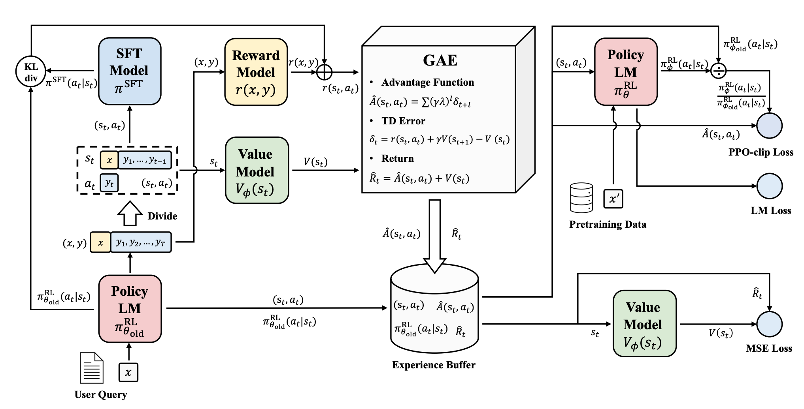

# RLHF

## Reward Modeling

 The modeling loss for each pair of preferred and dispreferred samples is
$$
L(\psi)=\log\sigma(r(x,y_w)-r(x,y_l))
$$

- $r(x, y)$: a single scalar predicted reward for prompt x and response y

Adding imitation learning, which introduces the autoregressive LM loss on the preferred response of each pair, allowing the model to imitate the preferred response in each sentence pair.
$$
L(\psi)=-\lambda E_{(x,y_w,y_l)\sim D_{rm}}[\log\sigma(r(x,y_w)-r(x,y_l))]+\beta_{rm}E_{(x,y_w)\sim D_{rm}}[\log(r'(x,y_w))]
$$

## Reinforcement Learning

The aim of RL is to find an optimal behavior strategy for the agent to maximize the cumulative reward (return) over a trajectory $\tau=\{s_1,a_1,...,s_T, a_T\}$. The return could be either finite-horizon undiscounted return $R(\tau)=\sum^{T'}_{t=1}r(s_t,a_t)$, the sum of rewards accumulated within a fixed number of steps, or infinite-horizon discounted return $R(\tau)=\sum^{\infin}_{t=0}\tau^tr(s_t,a_t)$, taking into account of all rewards obtained by the agent.

### Policy Gradient

Improve the parameterized policy $\pi(a|s,\theta)$ using gradient ascent algorithm.
$$
\theta\leftarrow\theta+\alpha\nabla_\theta J(\theta)
$$

- $J(\theta)$: the expected return when following policy $\pi(\theta)$
- $\nabla_\theta J(\theta)$: policy gradient

A general form of policy gradient:
$$
\nabla_\theta J(\theta)=E_{\tau\sim\pi_\theta}[\sum^T_{t=0}\nabla_\theta\log \pi_\theta(a_t|s_t)\Phi_t]
$$

- $\Phi_t$ could be any of $R(\tau)$, $\sum^T_{t'=t}R(s_{t'},a_{t'})$, or $\sum^T_{t'=t}R(s_{t'},a_{t'})-b(s_t)$. All of these lead to the same expected value for the policy gradient, but with different variances.

Although unbiased, different trajectories can result in diverse returns, which leads to high variance. To reduce the variance, a common strategy is to use advantage function estimates in place of raw returns in the policy gradient update rule
$$
\Phi_t=A(s_t,a_t)
$$
Generally, advantage function represents how much better it is to make a specific action $a_t$ at state $s_t$ compared to the average expected return at $s_t$
$$
A(s_t,a_t)=Q(s_t,a_t)-V(s_t)
$$

### Generalized Advantage Estimation

In practice, we use returns (sum of rewards) from actual episodes to estimate the $Q$ function. Typically, Temporal Difference (TD) k steps return is used:
$$
\hat R^k_t=r_t+\gamma r_{t+1}+...+\gamma^{(k-1)}r_{t+k-1}+\gamma^k V(s_{t+k})
$$
and produce the so called k-step advantage
$$
\hat A^k_t=\hat R^k_t-V(s_t)=\sum_{l=0}^{k-1}\gamma^l\delta_{t+l}
$$
where
$$
\delta_t=r_t+\gamma V(s_{t+1})-V(s_t)
$$
is the TD error. If k is small, the bias is high because the advantage estimation is based on fewer steps and depends heavily on the accuracy of the value function. If k is large, the variance could be high because the estimation involves many noisy rewards.

In order to balance the trade-off, GAE defines the advantage function as an exponential moving average of k-step advantages, with weights $(1-\lambda)\lambda^{(k-1)}$
$$
\hat A^{GAE(\gamma, \lambda)}_t=(1-\lambda)(\hat A^{(k=1)}_t+ \lambda A^{(k=2)}_t+\lambda^2 A^{(k=3)}_t+...)\\=\sum^\infin_{l=0}(\gamma\lambda)^l\delta_{t+l}
$$
Setting $\lambda=0$ or $\lambda=1$ brings high bias and high variance estimators, respectively
$$
\hat A^{GAE(\gamma, 0)}_t=\delta_t=r_t+\gamma V(s_{t+1})-V(s_t) \\
\hat A^{GAE(\gamma, 1)}_t=\sum^\infin_{l=0}\gamma^l\delta_{t+l}=\sum^\infin_{l=0}\gamma^lr_{t+l}-V(s_t)
$$
Then we get an accurate estimation of advantage function $A(s_t,a_t)$, which plays a crucial role in policy gradient estimation
$$
\nabla_\theta \hat J(\theta)=\frac{1}{|D|}\sum_{\tau\in D}\sum^T_{t=1}\nabla_\theta\log\pi_\theta(a_t|s_t)\hat A_t\\=\hat E_t[\log\pi_\theta(a_t|s_t)\hat A_t]
$$
