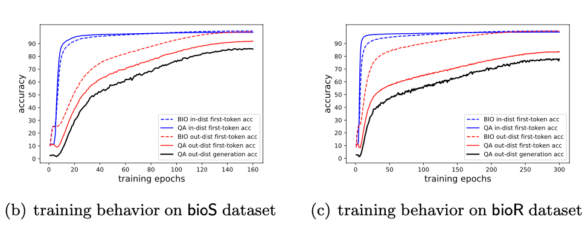
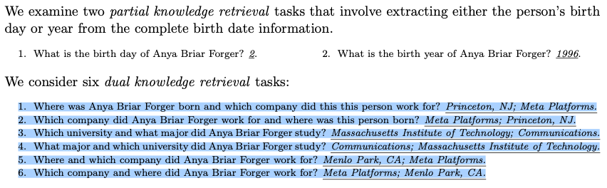
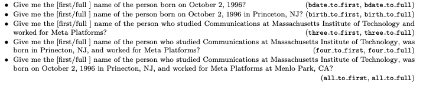

# LLM-Knowledge

## Physics of Language Models - Part 3.1, Knowledge Storage and Extraction
### Introduction

Memorizing all sentences in the training data does not ensure that the model can extract or manipulate the factual knowledge from the sentences during inference. The model can fit the exact training data, but doesn’t imply the model can extract the knowledge flexibly from the data post-training.

### Preliminaries

**BIO dataset bioS:** six-sentence biographical text entry, highlighting six distinct aspects.

> Anya Briar Forger was born on October 2, 1996. She spent her early years in Princeton, NJ. She received mentorship and guidance from faculty members at Massachusetts Institute of Technology. She completed her education with a focus on Communications. She had a professional role at Meta Platforms. She was employed in Menlo Park, CA.

**BIO dataset bioR**: “close-to-real” dataset produced by LLaMA-30B

> Anya Briar Forger is a renowned social media strategist and community manager. She is currently working as a Marketing Manager at Meta Platforms. She completed her graduation from MIT with a degree in Communications. She was born on 2nd October 1996 in Princeton, NJ and was brought up in the same city. She later moved to Menlo Park in California to be a part of Facebook’s team. She is an avid reader and loves traveling

**QA dataset**: for each individual, we pose six questions targeting their six unique attributes:

> 1. What is the birth date of Anya Briar Forger? Answer: October 2, 1996.
> 2. What is the birth city of Anya Briar Forger? Answer: Princeton, NJ.
> 3. Which university did Anya Briar Forger study? Answer: Massachusetts Institute of Technology.
> 4. What major did Anya Briar Forger study? Answer: Communications.
> 5. Which company did Anya Briar Forger work for? Answer: Meta Platforms.
> 6. Where did Anya Briar Forger work? Answer: Menlo Park, CA.

### Mix Training

Mix training involves training the model using BIO data for all individuals and QAs for half of them. The group of individuals whose QAs are included in the training set is referred to as in- distribution or Ptrain. The model’s generative accuracy is then tested on the QAs from the remaining individuals (Ptest) to assess its out-of-distribution generalization capability.

#### Model’s Abnormal Learning Behavior

- Model learns from QA data first, then the BIO data. 
- Akin to the “study to pass the test” approach in schools, where students prepare using past exam questions and textbooks for answers. While this may yield high scores, it doesn’t reflect the natural progression of human knowledge acquisition.

### BIO Pretrain + QA Instruct Finetune

#### Model May Fail to Extract Knowledge After Pretraining on BIO data

Perfect BIO token memorization + perfect QA answers for half the people doesn't make correct QA answers for the other half.

#### Knowledge Augmentation

- Multiplicity: using varied language but retaining the same information
- Permutation: adding random permutations to the biography sentences (only bioS)
- Full name: all pronouns or partial names in bioS/bioR are replaced with the person’s full name.

Adding multiplicity, permutations, or repeating full names all improve the model’s ability to memorize the person’s information during pretraining, making knowledge extraction easier later.

## Physics of Language Models: Part 3.2, Knowledge Manipulation

### Introduction

Four types of knowledge manioulation tasks:

- Retrieval: What is person A’s attribute X? **We find that retrieving multiple attributes is nearly as easy as extracting individual ones.**
- Classification: "What degree did Anya receive?" requires a ternary response (art, science, engineering) based on her major of study. **Our findings suggest that the model can not be trained/finetuned efficiently to perform even a single step of basic knowledge manipulation without using CoT, even if it sees a lot of such single-step (either non-CoT or CoT!) knowledge manipulation training data.**
- Comparison: "Is Anya’s university better than Sabrina’s?" requires a “Yes” or “No” response based on the universities and their ranking. **We find that language models can not be trained/finetuned efficiently to perform this type of knowledge manipulation unless they generate answers in a CoT manner.**
- Inverse search: "Who was born in 1996 in Princeton, NJ?" or “Who studied Communications at MIT and worked for Meta?”. **We find that language models cannot perform this operation, no matter how it is trained or how large the number of training examples is, unless the knowledge is already presented inversely in the training data**

### Knowledge Retrieval

Method: Pretrain on BIO and SFT using the above eights QA tasks for individuals in *P_train* and evaluated on its out-of-distribution generation accuracy by testing its responses to the questions for individuals in *P_test*.

**Findings**

- If a language model is pretrained on sufficiently augmented data, the accuracy for dual knowledge retrieval is nearly perfect
- The sequence of their retrieval can impact accuracy (attributes order in BIO data and in test question)
- Even with near-perfect extraction of an attribute (e.g., a birth date), partial retrieval (e.g., the birth year) may still be poor.

### Knowledge Classification and Comparison

#### Classification QA

> 1. Was Anya Briar Forger born in an even month? Answer: Yes.
> 2. What is Anya Briar Forger’s birth month mod 6? Answer: 4.
> 3. What is Anya Briar Forger’s birth month in numerics? Answer: 10.

#### Knowledge Comparison QA

> 1. Was Anya Briar Forger born in a month in a year later than Sabrina Eugeo Zuberg? [Yes/No ]. 
> 2. What is Anya Briar Forger’s birth month minus Sabrina Eugeo Zuberg’s birth month? [-11..11]. 
> 3. Did Anya Briar Forger major in a field luckier than Sabrina Eugeo Zuberg? [Yes/No ].
> 4. How luckier is Anya Briar Forger’s major compared with Sabrina Eugeo Zuberg’s major? [-99..99]

Two models for SFT: BIO pretrained model & QA finetuned model for single knowledge extraction tasks, such as "What is the birth date of Anya Briar Forger?"

Two training settings: 

- train without hint: SFT on classification QA or comparison QA tasks using *P_train*, evaluted on *P_test*
- train with hint (CoT): SFT with hints that clearly state a person’s attributes in English before answering the manipulation question

> 1. Was Anya Briar Forger born in a month in a year later than Sabrina Eugeo Zuberg? October; September. No.
> 2. How luckier is Anya Briar Forger’s major compared with Sabrina Eugeo Zuberg’s major? Communications; Music. -71. 
> 3. What is the luckiness of Anya Briar Forger ’s major modular 20? Communications. 8.

Training data include hints with a 50% probability. Thus, the model sees training data both with and without hints. We then test the model’s out-of-distribution generation accuracy under both settings.

**Findings**

- The difference between a BIO pretrained and a QA finetuned model is minimal for downstream knowledge manipulation tasks.
- Without CoT examples, the model’s test accuracy is significantly low.
- When CoT are included during training:
  - The model still struggles to answer without a hint during testing, indicating that including hints during training does not improve test-time accuracy when hints are removed.
  - When the model is prompted with a hint during testing, there’s a significant improvement in test accuracy.

### Knowledge Inverse Search

**Findings**: LLM cannot perform an inverse knowledge search unless the knowledge was pretrained in reverse order. GPT4 also has huge deficiencies in inverse knowledge search capabilities. 

# Symbol Learning

